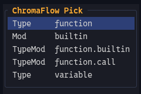

# ChromaFlow / cf.nvim

[Why ChromaFlow](#why-chromaflow) · [How it fits together](#how-the-pieces-fit) · [Install](#installation-and-setup) · [Quick try](#quick-try-with-the-bundled-theme) · [Minimal theme](#minimal-theme) · [CFPick](#theme-design-with-cfpick) · [Commands](#useful-commands) · [Performance](#performance-tests-and-benchmarks) · [Documentation](#documentation)

**ChromaFlow** replaces massive, static color tables with a highly optimized Lua-based compiler, a live in-buffer preview editor, and real-time color pipeline transformations.

## Why ChromaFlow

I built ChromaFlow because large static-table themes annoyed me. For the way I
build themes, they were slower than I wanted and became maintenance hell once they
grew: repeated strings and highlight tables get pushed around again and again, the
same conceptual style is copied across many names, relationships disappear into a
giant list, and changing one idea often means hunting through several unrelated
entries.

I wanted the opposite: small modules that describe intent, shared/interned styles
instead of repeated definitions, semantic resolution where it helps, exact raw
names where it does not, and tools that let me edit the theme from the code I am
actually looking at.

That led to ChromaFlow's main pieces:

- small Lua-based `.cf` theme modules;
- one resolver for Vim syntax, Tree-sitter and LSP semantic highlights;
- style interning/deduplication instead of repeated highlight definitions;
- cached hot paths and early exits;
- `CFPick` for live theme editing at the cursor;
- automatic theme watching/reload;
- runtime styles, diagnostics, ColorTrace and LineBlend in the same system.

## How the pieces fit

```text
color.cf + config.cf + .cf modules
                |
                v
        module setup / styles
                |
        resolver or raw names
                |
                v
          compiled theme
                |
                v
        Neovim highlights

runtime modules  -> sparse live overrides
CFPick / CFSave   -> inspect compiled ownership, preview, persist source edits
ColorTrace        -> explain pipeline color transformations in source
LineBlend         -> keep CursorLine visible across styles with backgrounds
```

### Documentation map

| If you want to... | Read |
| --- | --- |
| install ChromaFlow and build the first theme | [`getting-started.md`](README/getting-started.md) |
| understand theme roots, `.cf-theme`, reserved files and fallback | [`theme-structure.md`](README/theme-structure.md) |
| define palette colors and transform them | [`colors.md`](README/colors.md), then [`pipeline.md`](README/pipeline.md) |
| style language semantics | [`language.md`](README/language.md) |
| style plugin-owned groups/captures | [`plugin.md`](README/plugin.md) |
| style editor UI groups | [`ui.md`](README/ui.md) |
| target exact Neovim highlight names | [`raw.md`](README/raw.md) |
| understand how Type/Mod/TypeMod names become concrete highlights | [`resolver.md`](README/resolver.md) |
| apply temporary or dynamic styles after the theme is loaded | [`runtime.md`](README/runtime.md) |
| inspect and edit the style under the cursor | [`picker.md`](README/picker.md) |
| understand diagnostics and pipeline tracing | [`diagnostic.md`](README/diagnostic.md), [`colortrace.md`](README/colortrace.md) |
| keep CursorLine coherent across styled backgrounds | [`lineblend.md`](README/lineblend.md) |
| reuse ChromaFlow's standalone float renderer | [`float.md`](README/float.md) |
| run regression tests or reproduce performance measurements | [`tests_benchmarks.md`](README/tests_benchmarks.md) |

## Installation and setup

With Neovim's built-in `vim.pack` (Neovim 0.12+):

```lua
vim.pack.add({
  "https://github.com/Gnibor/chromaflow.nvim",
})
```

With `packer.nvim`:

```lua
use("Gnibor/chromaflow.nvim")
```

With `lazy.nvim` / LazyVim:

```lua
return { "Gnibor/chromaflow.nvim" }
```

### Quick try with the bundled theme

If you want to try ChromaFlow before creating your own theme root, the repository
ships with the complete `examples/themes/dark` reference theme. Its installation
location does not matter: Neovim can find it through the plugin's `runtimepath`.

Use this setup instead of a custom `theme_path`:

```lua
local marker = vim.api.nvim_get_runtime_file(
  "examples/themes/.cf-theme",
  false
)[1]

assert(marker, "ChromaFlow example theme not found")

require("cf").setup({
  theme_path = vim.fs.dirname(marker),
  picker = true,
})
```

This loads the bundled reference theme directly, so you can immediately try commands
such as `:CFPick`, `:CFTheme`, `:CFReload`, ColorTrace, and LineBlend. When you are
ready to create your own theme, point `theme_path` at your own theme root instead.

### Configure your own theme root

Then configure ChromaFlow:

```lua
require("cf").setup({
  theme_path = vim.fn.stdpath("config") .. "/themes",
  picker = true,
})
```

`picker = true` enables `:CFPick` and `:CFSave`. Theme watching is enabled by
default. LuaSnip is optional and is only integrated when it is already loaded.

## Minimal theme

A theme root can be as small as:

```text
themes/
├── .cf-theme
└── mytheme/
    ├── color.cf
    └── lua.cf       # example name; module filenames are otherwise free
```

`.cf-theme` contains exactly two non-empty lines: default theme, then active theme.

```text
mytheme
mytheme
```

`color.cf` provides the shared palette:

```lua
return {
  bg = "#111318",
  fg = "#d6d6d6",
  comment = "#73829a",
  variable = "#b7ccb9",
  ["function"] = "#d7ad7c",
  type = "#8dbfc8",
  keyword = "#b5a2ce",
}
```

A palette must exist somewhere in the active/root/default fallback chain.

A minimal language module (for example `lua.cf`; the filename itself is arbitrary):

```lua
local hl = require("cf.hl.setup")
local c = hl.colors
local l = hl.language

return l.setup("lua", {
  l:group("comment", { fg = c.comment, italic = true }),
  l:group("variable", { fg = c.variable }),
  l:group("function", { fg = c["function"], types = { "method" } }),
  l:group("type", {
    fg = c.type,
    types = { "class", "struct", "enum", "interface" },
  }),
  l:group("keyword", { fg = c.keyword }),
})
```

## Theme design with `CFPick`

The picker exists to remove the usual loop:

```text
:Inspect → copy name → edit theme → reload → return to source → repeat
```

Place the cursor on real code and run `:CFPick`. It shows the concrete editable
targets available at that position. LSP and Tree-sitter information can coexist;
the picker avoids inventing targets that are not actually present.



*CFPick can expose several concrete Type, Mod, and TypeMod targets at the same
cursor position.*

Picker changes are previewed immediately through the runtime layer. When the
result is right, use `:CFSave` to persist the confirmed edits and reload the theme.

If a language module exists but the current style comes from `generic`, CFPick
can ask whether the edit should remain generic or become language-specific.

[`examples/showcase/`](examples/showcase/) contains language playgrounds for
designing themes directly against real syntax, Tree-sitter and LSP output.

## Theme layout and fallback

Only two theme-module filenames are reserved by ChromaFlow:

| Reserved file | Purpose |
| --- | --- |
| `color.cf` | Palette |
| `config.cf` | Theme-wide configuration |

All other `.cf` module filenames are free. Names such as `generic.cf`,
`lang-lua.cf`, `plugin-telescope.cf`, `core-ui.cf` or files below `runtime/` are
conventions/examples only; the module kind comes from the module itself, not from
its filename.

[`examples/themes/dark`](examples/themes/dark/) is the complete reference theme.
Smaller bundled themes exercise active/default fallback and target selection.

## Useful commands

| Command | Purpose |
| --- | --- |
| `:CFReload` | Reload the selected theme |
| `:CFPick` | Edit the target under the cursor |
| `:CFSave` | Persist confirmed picker edits |
| `:CFTheme` | Open the theme menu |
| `:CFTheme <name>` | Select a theme |
| `:CFTheme <name> default=true` | Select a theme and make it the default |
| `:LineBlendToggle` | Toggle LineBlend |
| `:LineBlend <0..100>` | Set the LineBlend amount |
| `:LineBlendReload` | Hard-reload LineBlend state |

Runtime modules additionally expose `:CFApply`, `:CFReplace`, `:CFReset` and
`:CFClear`.

## Snippets

With LuaSnip available, ChromaFlow registers starter snippets for real `.cf` files:
`language`, `plugin`, `ui` and `runtime`, plus smaller group/link helpers.

An unnamed buffer is not a `.cf` file yet; save it with a `.cf` filename before
expecting the snippets to appear.

## Performance, tests and benchmarks

Performance is a design requirement, not an afterthought. Resolver caches, style
interning/deduplication, early exits and hot-path allocation behaviour are part of
the architecture.

As a concrete reference rather than a promise, the checked-in clean-state report
uses an Intel i5-10310U and the bundled `dark` theme (32 modules, 938 compiled
actions). In the run with a real Lua buffer open, average `cf.reload()` time was
about **12.8 ms** in the Minimal setup and **23.1 ms** with Picker + ColorTrace
enabled. The full distributions and host details are kept under `tests/` so local
results can be compared against the same workload.

The canonical benchmark files are:

```text
tests/full_benchmark.lua
tests/benchmark.lua
tests/benchmark.md
```

`full_benchmark.lua` covers end-to-end theme operations, source loading, DSL
compilation, resolver cold/hot paths, colour/pipeline work, apply/consumer work,
runtime/picker/LineBlend/watcher paths, diagnostics/ColorTrace and float rendering.
It runs separate Minimal, Picker, ColorTrace and Picker+ColorTrace scenarios.

The benchmark engine reports `min`, `avg`, `p50`, `p90`, `p95`, `p99` and `max`,
with batched measurements normalized back to time per real call. See
[`tests/benchmark.md`](tests/benchmark.md) for the measurement model.

The `tests/` directory also contains headless regression tests for the resolver,
theme compiler, picker/save flow, runtime state, diagnostics, ColorTrace,
LineBlend, theme selection and reference themes.

## Documentation

The chapter map near the top of this README is the recommended reading order. The
repository also contains practical reference material:

- [`examples/themes/README.md`](examples/themes/README.md) — theme/fallback layout;
- [`examples/themes/dark/README.md`](examples/themes/dark/README.md) — semantic reference theme;
- [`examples/showcase/`](examples/showcase/) — theme-design playgrounds;
- [`tests/clean_state_benchmark_report_20260930-1045.md`](tests/clean_state_benchmark_report_20260930-1045.md) — checked-in clean-state performance reference;
- [`tests/benchmark.md`](tests/benchmark.md) — benchmark engine and methodology;
- [`luals/library/cf/`](luals/library/cf/) — current LuaLS API metadata.


## Current status & contributions

ChromaFlow is stable, fully functional, and ready for daily theme authoring. The core engine, resolver, picker, and runtime layers are feature-complete. 

Please note:
- **Passive Maintenance:** Due to long-term personal health reasons, this repository is maintained passively and irregularly. Issues might remain open for a long time or receive no direct replies.
- **Known Quirks:** There are still a few minor bugs and edge cases under the hood that do not affect the main theme compilation or picker workflows. 
- **Contributions welcome:** If you find a bug or want to help add small features, pull requests are highly appreciated. If the project grows and stable maintainers step up, I am open to handing over co-maintenance.
