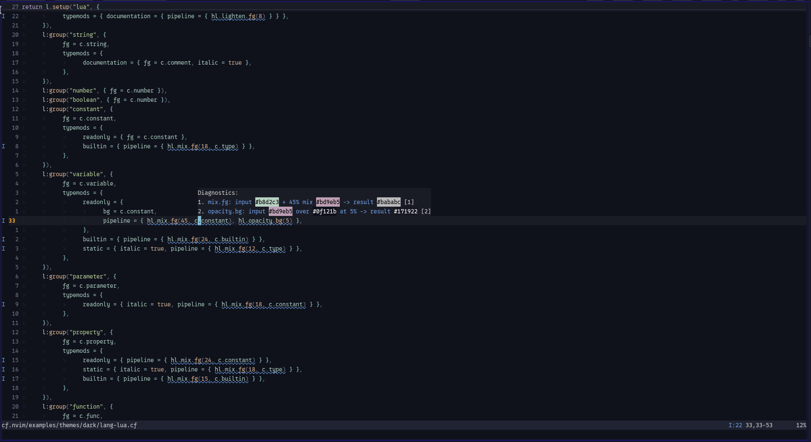
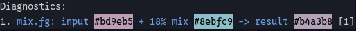
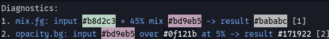

# ColorTrace

## Contents

- [Enable ColorTrace](#enable-colortrace)
- [What is traced](#what-is-traced)
- [Source locations](#source-locations)
- [Diagnostic display](#diagnostic-display)
- [Which files ColorTrace traces](#which-files-colortrace-traces)
- [ColorTrace and CFPick](#colortrace-and-cfpick)
- [Performance behavior](#performance-behavior)
- [Related chapters](#related-chapters)

ColorTrace shows how ChromaFlow's color pipelines transform a color step by
step inside the source `.cf` file.

It uses the same pipeline operations that produce the final highlight style, so
the trace follows the actual color calculation rather than a separate preview
implementation.

ColorTrace is also used by CFPick. The diagnostic view and the picker share the
same tracing infrastructure, but they use it differently.

## Enable ColorTrace

Enable the diagnostic view through `require("cf").setup()`:

```lua
require("cf").setup({
  diagnostic = {
    color_trace = true,
  },
})
```

`diagnostic.color_trace` is independent from the normal diagnostic severity and
message filters. Enabling it does not enable HINT/WARN diagnostics and does not
require `diagnostic.messages.info = true`.

With ColorTrace enabled, `.cf` buffers get an `H` mapping. Put the cursor on a
line containing ColorTrace diagnostics and press:

```text
H
```

to open the ChromaFlow diagnostic float for that line.

## What is traced

ColorTrace covers the normal ChromaFlow color-pipeline operations:

```text
mix
opacity
brightness
lighten
darken
shiftHue
gamma
```

on all five supported color channels:

```text
fg
bg
sp
cfg
cbg
```

Each pipeline operation produces one trace record containing the operation,
channel, input color, operation arguments, result color, and the backdrop when
the operation needs one.

For example, traces are rendered in forms such as:

```text
brightness.fg: input <color> by 10% -> result <color>
mix.fg: input <color> + 20% mix <color> -> result <color>
opacity.bg: input <color> over <color> at 50% -> result <color>
shiftHue.sp: input <color> by 30° -> result <color>
gamma.fg: input <color> gamma 1.1 -> result <color>
```

The exact values come from the active pipeline calculation.

`cfg` and `cbg` follow the same terminal-color fallback rules as the normal
pipeline: when no explicit terminal color exists yet, `cfg` starts from `fg`
and `cbg` starts from `bg` before the pipeline operation is applied.

## Source locations

A trace is attached to the pipeline operation that produced it. When the Lua
Tree-sitter parser is available, ColorTrace records the complete source range of
the individual call, for example:

```lua
hl.brightness.fg(10)
```

rather than only the surrounding `pipeline` field or group declaration.

The pipeline-local operation index is kept with the diagnostic as its code, so
multiple operations on the same source line remain distinct and ordered.

The Lua Tree-sitter parser is not required for the color calculation itself. If
an exact operation range cannot be resolved, ColorTrace can still trace the
operation using its source line with a reduced source position.

## Diagnostic display

ColorTrace records are rendered through the same `vim.diagnostic` namespace as
ChromaFlow's other source diagnostics, with INFO severity.

Their visibility is controlled by `diagnostic.color_trace`, not by the normal
`diagnostic.messages.info` switch.

The `H` diagnostic float also decorates the color values in a trace with small
foreground/background swatches, making the input, argument and result colors
visually distinguishable while inspecting a pipeline.



A line with a single traced pipeline operation produces one trace entry:



If several pipeline operations belong to the same source line, the float keeps
them as separate ordered trace entries:



See [`diagnostic.md`](diagnostic.md) for the normal HINT/WARN/ERROR diagnostic
policy and rendering lifecycle.

## Which files ColorTrace traces

ColorTrace is intentionally source-local when used as a diagnostic feature.
During normal theme compilation it traces pipeline operations only for theme
`.cf` files that are currently visible in the **active tabpage**.

| Source state | ColorTrace behavior |
| --- | --- |
| Visible `.cf` source in the current tabpage | Trace while the module executes |
| Hidden source, or source visible only in another tabpage | No ColorTrace work for that source at that time |

When a compiled theme `.cf` file is opened later, ColorTrace re-executes exactly
that module to rebuild its source diagnostics and traces, then publishes the
results only for that buffer. This diagnostic replay does not apply highlight
actions or rebuild the whole theme.

After a theme reload or colorscheme change, an opened source file is seeded
again against the new compiled theme when needed.

## ColorTrace and CFPick

CFPick uses ColorTrace's tracing infrastructure even when the diagnostic
ColorTrace view is disabled.

With:

```lua
picker = true
```

ChromaFlow traces the theme sources during compilation and keeps the resulting
source trace snapshot for the compiled theme. The Pipeline editor uses these
records for the original pipeline operations and their source identity while
still evaluating edited operations through the normal pipeline executor.

The picker trace cache is transactional:

```text
compile starts
    -> build staging trace snapshot

compile succeeds and that theme is applied
    -> staging snapshot becomes current

compile fails
    -> discard staging snapshot
    -> keep the previous current snapshot
```

Stopping the picker discards its trace cache.

### Picker + diagnostic ColorTrace

When both features are enabled, the picker already has a trace snapshot for all
compiled theme sources. If a previously hidden `.cf` file is opened, ColorTrace
re-executes the module to refresh its ordinary authoring diagnostics but reuses
the picker-owned color trace instead of running the color pipeline tracing a
second time.

So the combined modes are:

| Mode | Behavior |
| --- | --- |
| ColorTrace only | Trace visible sources on demand; no persistent color-trace cache |
| Picker only | Trace all compiled theme sources and retain the picker source trace snapshot; no ColorTrace INFO diagnostics |
| Picker + ColorTrace | Picker retains the source trace snapshot and ColorTrace diagnostics reuse it when possible |

## Performance behavior

When neither ColorTrace nor CFPick is enabled, `cf.hl.setup` exposes the normal
pipeline builders directly and the normal style path does not collect trace
metadata.

With ColorTrace enabled, tracing work is restricted to visible source files in
the active tabpage. With the picker enabled, tracing all compiled source files is
intentional because the picker needs persistent source information for editing.

This keeps the normal theme path free from ColorTrace source parsing and trace
construction unless one of the features that needs it is active.

The checked-in clean-state reference makes that tradeoff visible: with a real Lua
buffer open, average `theme.compile()` was about **6.7 ms** Minimal and **10.6 ms**
with diagnostic ColorTrace enabled; average `cf.reload()` was about **12.8 ms** and
**20.1 ms** respectively. Picker + ColorTrace together measured about **23.1 ms**
for the same reload workload. These values belong to the documented i5-10310U
reference run and are included only as a scale comparison.

## Related chapters

- [`pipeline.md`](pipeline.md) — color operations, channels and fallback rules.
- [`diagnostic.md`](diagnostic.md) — diagnostic policy and normal diagnostic output.
- [`picker.md`](picker.md) — CFPick, Pipeline editing and `CFSave`.
