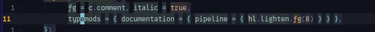
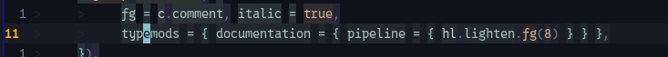
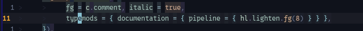

# LineBlend

## Contents

- [Visual comparison](#visual-comparison)
- [Setup](#setup)
- [Blend amount](#blend-amount)
- [Tree-sitter requirement](#tree-sitter-requirement)
- [What LineBlend follows](#what-lineblend-follows)
- [Foregrounds are normally untouched](#foregrounds-are-normally-untouched)
- [Virtual text](#virtual-text)
- [Visual mode](#visual-mode)
- [Commands](#commands)
- [Theme reloads and theme switches](#theme-reloads-and-theme-switches)
- [ChromaFlow menus and Pipeline editor](#chromaflow-menus-and-pipeline-editor)
- [Performance model](#performance-model)
- [Lua API](#lua-api)
- [Why LineBlend is part of ChromaFlow](#why-lineblend-is-part-of-chromaflow)

LineBlend keeps `CursorLine` useful when syntax, semantic, plugin, or UI
highlights have their own background colors.

Without it, a highlight with its own `bg` covers the `CursorLine` background on
the cursor row. That makes background-heavy themes awkward: the more useful
per-token or per-region backgrounds you add, the more fragmented the cursor line
becomes.

LineBlend mixes those existing backgrounds toward the current `CursorLine`
background only on the active cursor row.

```text
normal row
    original highlight background

cursor row
    original highlight background
        + CursorLine background
        -> temporary LineBlend background
```

The original highlight groups are left unchanged. Moving the cursor therefore
reveals the normal theme again immediately.

## Visual comparison

The screenshots below use the same line, theme, and `CursorLine`. Only the
LineBlend state or amount changes.

| Off | 50% — default | 75% |
| --- | --- | --- |
|  |  |  |

At the default `50`, token backgrounds remain clearly recognizable while the
cursor row becomes more continuous. Raising the amount to `75` pulls those
backgrounds further toward `CursorLine.bg`.

## Setup

LineBlend is enabled by default:

```lua
require("cf").setup({
  lineblend = {
    autostart = true,
    blend = 50,
  },
})
```

Options:

| Option | Type | Meaning | Default |
| --- | --- | --- | ---: |
| `autostart` | boolean | Start LineBlend during `cf.setup()` | `true` |
| `blend` | number | CursorLine mix amount from `0..100` | `50` |

Disable automatic activation with:

```lua
require("cf").setup({
  lineblend = {
    autostart = false,
  },
})
```

The configured blend value is still retained, so `:LineBlendToggle` can start it
later with that value.

## Blend amount

For every background that needs LineBlend, the rendered color is:

```text
mix(original background, CursorLine background, blend)
```

So:

| `blend` | Result |
| ---: | --- |
| `0` | Keep the original highlight background |
| `50` | Halfway between the original background and CursorLine |
| `100` | Use the CursorLine background completely |

A value around the middle keeps the original background recognizable while still
making the cursor row continuous.

Change it at runtime with:

```vim
:LineBlend 35
```

The accepted range is `0..100`.

## Tree-sitter requirement

For buffers whose syntax highlighting comes from Tree-sitter, the parser for the
current language must be installed and its Tree-sitter highlighter must be active.
LineBlend reads the active capture ranges directly; it does not reconstruct
Tree-sitter highlights when the parser/highlighter is missing.

Vim syntax, LSP semantic-token/extmark highlights, ordinary extmarks, and virtual
text are collected separately, but they do not replace a missing Tree-sitter
parser for Tree-sitter-highlighted code.

## What LineBlend follows

LineBlend works from the highlight state that is actually rendered on the current
row. Backgrounds can come from:

- Vim syntax,
- Tree-sitter captures,
- LSP semantic-token/extmark highlights,
- ordinary extmark `hl_group` and `line_hl_group` highlights,
- and supported virtual text.

Overlapping sources keep their Neovim priority/order when the effective
background is determined.

Only regions with a real background need an overlay. Text with no explicit
background is left alone so the normal `CursorLine` can show through directly.
A background equal to `Normal.bg` likewise needs no replacement.

`hl_eol` backgrounds are preserved when they reach the end of the line.

## Foregrounds are normally untouched

LineBlend exists to repair background continuity. It does not recolor ordinary
text foregrounds.

There is one deliberate exception for virtual text: block/fill glyphs such as
`█`, `▓`, `▒`, `░`, `▀`, `▄`, and related block characters often use their
foreground as a visible filled background. For those glyphs, LineBlend also
mixes the foreground toward `CursorLine.bg` so the block remains visually
consistent with the cursor row.

Ordinary virtual-text foreground colors are preserved.

## Virtual text

LineBlend supports non-inline virtual text where a background-bearing chunk or
fill glyph overlaps cursor-line whitespace or the area after end-of-line. This
covers normal `eol`, `overlay`, `right_align`, `eol_right_align`, and explicit
window-column placements used by plugins.

Inline virtual text is intentionally left to Neovim because re-emitting inline
text would alter the line layout a second time.

Virtual text without a background and without a recognized fill glyph needs no
LineBlend work and stays untouched.

## Visual mode

While Visual mode is active, LineBlend clears its cursor-row overlay and leaves
the focused-row rendering to Neovim's normal Visual highlighting.

Leaving Visual mode rebuilds the current cursor row automatically.

## Commands

### `:LineBlendToggle`

Toggle LineBlend without changing the configured blend amount.

```vim
:LineBlendToggle
```

### `:LineBlend {0..100}`

Change the blend amount and refresh the current result.

```vim
:LineBlend 65
```

### `:LineBlendReload`

Hard-rebuild LineBlend's generated highlight state:

```vim
:LineBlendReload
```

Normal ChromaFlow theme reloads do **not** hard-reset LineBlend. They refresh the
current cursor row while keeping LineBlend's session caches. Use
`:LineBlendReload` when you explicitly want those generated groups rebuilt.

## Theme reloads and theme switches

A normal `cf.reload()` recompiles and reapplies the theme, then calls the normal
LineBlend refresh path.

The same cached refresh happens after a ChromaFlow theme switch and after
`CFSave` reloads the edited theme.

If `CursorLine` itself changes, LineBlend updates the generated mixed colors to
use the new `CursorLine.bg`.

If `CursorLine` has no background, there is nothing for LineBlend to mix toward
and it does not draw an overlay.

## ChromaFlow menus and Pipeline editor

ChromaFlow's floating menus and Pipeline editor temporarily suspend LineBlend
while they own the focused window. If LineBlend was active before opening them,
it is restored when they close.

## Performance model

LineBlend only tracks the active cursor row.

Horizontal cursor movement on an unchanged row uses a fast cache check and does
not rebuild the overlay. A rebuild is triggered when the relevant row, text,
window, mode, diagnostics, or colorscheme state changes.

Normal buffer text is inspected only inside ranges that can actually contribute
a background. Full UTF-8/screen-cell work is reserved for relevant virtual text.
Generated mixed highlight groups are reused by source color instead of being
created again for every character or cursor movement.

Temporary yank highlighting is excluded from LineBlend's source scan.

The checked-in clean-state A/B report shows why the cache matters. In the Minimal
scenario, `lineblend.refresh()` stays around **0.6 µs** on the reference host,
while the explicit hard `lineblend.reload()` is about **14 µs** with an empty
buffer and about **65 µs** with a real source buffer to rebuild. The hard reload
is diagnostic/maintenance work; normal ChromaFlow reloads intentionally use the
cached refresh path instead.

## Lua API

LineBlend is also exposed as a small public utility:

```lua
local lineblend = require("cf").fn.lineblend
```

Activate it:

```lua
lineblend.activate({ blend = 50 })
```

`setup()` is an alias of `activate()`:

```lua
lineblend.setup({ blend = 50 })
```

Repeated activation reuses the already installed decoration provider and
autocommands.

Change the amount:

```lua
lineblend.set_blend(35)
```

Refresh the current row:

```lua
lineblend.refresh()
lineblend.refresh(true) -- bypass the last-row/line fast-path check
```

Hard-rebuild generated LineBlend highlight groups:

```lua
lineblend.reload()
```

Stop it:

```lua
lineblend.stop()
```

Query active state:

```lua
if lineblend.is_active() then
  ...
end
```

`lineblend.status()` exposes the current LineBlend state for inspection and
benchmark/debug tooling.

## Why LineBlend is part of ChromaFlow

ChromaFlow deliberately allows normal styles to use backgrounds. A language,
plugin, semantic token, diagnostic, or other highlight should not have to avoid
`bg` merely because Neovim's `CursorLine` would otherwise disappear underneath
it.

LineBlend makes those two ideas coexist:

```text
rich styles with their own backgrounds
                +
       a continuous CursorLine
```

That is the feature's job. It does not replace `CursorLine` or redesign the
underlying styles; it only blends the backgrounds that would cover it on the
current row.
