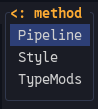
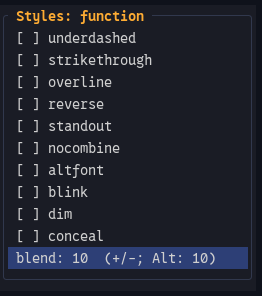
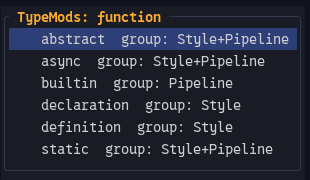
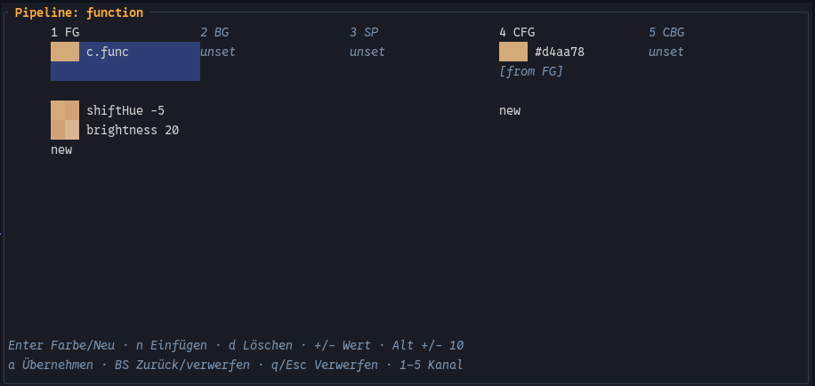

# CFPick and CFSave

## Contents

- [Enabling the picker](#enabling-the-picker)
  - [Lua Tree-sitter requirement](#lua-tree-sitter-requirement)
- [Cursor discovery](#cursor-discovery)
  - [LSP entries](#lsp-entries)
  - [Tree-sitter entries](#tree-sitter-entries)
  - [Vim/Syntax fallback](#vimsyntax-fallback)
- [Finding the editable CF rule](#finding-the-editable-cf-rule)
- [Creating a missing local rule](#creating-a-missing-local-rule)
- [Generic versus filetype-local source](#generic-versus-filetype-local-source)
- [Types inherited through `types = { ... }`](#types-inherited-through-types)
- [Edit menu](#edit-menu)
- [Style editor](#style-editor)
  - [Tri-state boolean values](#tri-state-boolean-values)
  - [Blend](#blend)
  - [Live preview](#live-preview)
  - [TypeMod Style inheritance](#typemod-style-inheritance)
- [TypeMods browser](#typemods-browser)
- [TypeMod row state](#typemod-row-state)
  - [TypeMod keys](#typemod-keys)
- [Pipeline editor](#pipeline-editor)
- [Pipeline base Style](#pipeline-base-style)
- [CFG / CBG colour fallback](#cfg--cbg-colour-fallback)
- [Palette selection](#palette-selection)
- [Pipeline operations](#pipeline-operations)
- [Pipeline keys](#pipeline-keys)
- [Pipeline preview and traces](#pipeline-preview-and-traces)
- [ColorTrace cache in picker mode](#colortrace-cache-in-picker-mode)
- [Pipeline source support](#pipeline-source-support)
- [Source metadata](#source-metadata)
- [Pending picker edits](#pending-picker-edits)
- [`CFSave`](#cfsave)
- [Style persistence](#style-persistence)
- [TypeMod rule persistence](#typemod-rule-persistence)
- [Pipeline persistence](#pipeline-persistence)
- [No-op edits](#no-op-edits)
- [Theme reload boundaries](#theme-reload-boundaries)
- [Performance model](#performance-model)
- [Summary](#summary)

`CFPick` is ChromaFlow's cursor-based inspector/editor for the highlight rules that
are active in the current Neovim session.

Its main purpose is to avoid the manual round trip of inspecting a highlight,
finding the responsible language/module declaration, and then entering the
corresponding Style, Mod, TypeMod, or Pipeline change by hand.


*One cursor position can expose several concrete editable Type, Mod, and TypeMod
targets.*

The normal workflow is:

```text
cursor highlight information
    -> picker entry
    -> owning compiled CF action/source
    -> Style / Pipeline / TypeMod edit with live preview
    -> CFSave writes confirmed edits back to source
    -> normal theme reload
```

The picker intentionally covers only that editing workflow. It is not a complete
editor for the ChromaFlow DSL.

It edits:

```text
Style flags + blend
colour bases + Pipeline operations
module Mods
concrete TypeMods
```

Theme structure and policy stay normal `.cf` source work. This includes
`style_targets`, `style_targets_clear`, general clear policy, compile priority,
module setup, general link construction, and creating/managing `types = { ... }`
relationships.

A Type inherited through `types = { ... }` can be detached automatically when a
picker edit needs its own declaration. That is part of saving the edit; CFPick
does not provide a general `types` relationship editor.

`CFSave` persists confirmed picker edits only. Browsing and live preview do not
rewrite source files.

See also:

- [`resolver.md`](resolver.md) for forward Type / Mod / TypeMod resolution;
- [`pipeline.md`](pipeline.md) for colour operations;
- [`runtime.md`](runtime.md) for sparse runtime state;
- [`language.md`](language.md), [`plugin.md`](plugin.md), and [`ui.md`](ui.md)
  for the declarations the picker edits.

---

# Enabling the picker

The picker is opt-in:

```lua
require("cf").setup({
    picker = true,
})
```

This enables:

```vim
:CFPick
:CFSave
```

Picker mode also keeps the compile data needed by the editors:

```text
declaration/action source identity
module mods source data
full group/link/setup ranges when the Lua parser is available
exact Pipeline operation ranges when the Lua parser is available
persistent ColorTrace data for the active compiled theme
```

With `picker = false`, that additional picker metadata/cache path is disabled.

## Lua Tree-sitter requirement

For source editing, install Neovim's **Lua Tree-sitter parser** before compiling
the theme with `picker = true`.

The parser is used in two places that matter to CFPick/CFSave:

```text
picker-enabled compile
    -> refine group/link/setup source positions
    -> record exact Pipeline operation ranges

Pipeline editor / CFSave
    -> parse the original DSL source
    -> locate and rewrite the owning tables/calls
    -> validate generated Lua before writing
```

The Pipeline editor requires the exact operation ranges captured during the
picker-enabled compile. If the Lua parser was missing at that time, enable it and
reload the theme before opening/saving Pipeline edits.

`CFSave` also parses every file it plans to change and refuses to write when the
Lua parser is unavailable or the generated source is invalid.

`cf.picker.start()` enables picker mode in `cf.colortrace`. `cf.picker.stop()`
closes an open Pipeline editor, disables the picker trace cache, and clears the
picker's pending edit/lookup state.

---

# Cursor discovery

`:CFPick` starts from the highlight information Neovim reports at the current
cursor position.

CFPick reads:

```text
LSP semantic tokens
Tree-sitter captures
Vim/Syntax highlight groups
```

LSP and Tree-sitter are both considered. Vim/Syntax is used only when neither of
them contributes a picker entry.

Duplicate entries with the same `(kind, name)` are shown once.

The main picker displays three entry kinds:

| Kind | Meaning | Example |
| --- | --- | --- |
| `Type` | a Type | `variable` |
| `Mod` | a modifier without a concrete Type | `readonly` |
| `TypeMod` | one concrete Type + modifier combination | `variable.readonly` |

## LSP entries

The LSP semantic-token API already provides the Type and modifier set as separate
fields. CFPick uses those fields directly.

For example:

```text
type      = variable
modifiers = readonly, documentation
```

produces:

| Picker entry | Value |
| --- | --- |
| Type | `variable` |
| Mod | `readonly` |
| TypeMod | `variable.readonly` |
| Mod | `documentation` |
| TypeMod | `variable.documentation` |

A token whose Type is literally named `modifier` remains a Type named
`modifier`; only the LSP `modifiers` set produces Mod entries.

Before falling back to generic token normalization, CFPick checks the current
compiled theme's resolver-derived reverse map. This lets server-specific
standalone modifiers resolve back to their exact module `mods` declaration.

For example, if a C language module contains:

```lua
mods = {
  functionScope = { ... },
}
```

then an LSP `functionScope` modifier can resolve to that editable Mod source even
if `@lsp.mod.functionScope` did not exist before the theme was compiled.

The values come from:

```lua
vim.lsp.semantic_tokens.get_at_pos(0)
```

## Tree-sitter entries

Tree-sitter provides concrete captures through `vim.inspect_pos()`.

**One active Tree-sitter capture produces one picker entry.** CFPick does not turn
a dotted capture into several displayed Type/Mod rows.

Examples:

| Tree-sitter capture | Picker entry | Value |
| --- | --- | --- |
| `@variable` | Type | `variable` |
| `@function.call` | TypeMod | `function.call` |
| `@variable.member` | TypeMod | `variable.member` |

Some standard Tree-sitter captures use a hierarchy whose semantic Type differs
from the first component. CFPick keeps a small picker-local reverse table for
those cases:

| Tree-sitter capture | Picker Type |
| --- | --- |
| `variable.parameter` | `parameter` |
| `module` | `namespace` |
| `string.regexp` | `regexp` |
| `number.float` | `float` |
| `function.method` | `method` |
| `keyword.function` | `function` |
| `keyword.operator` | `operator` |
| `keyword.type` | `type` |
| `keyword.modifier` | `modifier` |

The same Type spelling is used when that capture is the prefix of a longer
capture:

| Tree-sitter capture | Picker entry | Value |
| --- | --- | --- |
| `@function.method.call` | TypeMod | `method.call` |
| `@variable.parameter.builtin` | TypeMod | `parameter.builtin` |

`call` and `member` are valid suffixes inside concrete captures; seeing such a
suffix does not create an additional standalone Mod entry.

This reverse interpretation is picker-local. Forward theme resolution remains in
`cf.hl.resolver`.

## Vim/Syntax fallback

When neither LSP nor Tree-sitter contributes an entry, CFPick reads the syntax
stack from `vim.inspect_pos()`.

Each active `hl_group` becomes one Type entry. The concrete name is then matched
against the current compiled theme so CFPick can find the CF rule that owns its
style/source when one exists.

Raw actions are matched through this exact Vim/Syntax group path.

---

# Finding the editable CF rule

The cursor tells CFPick which existing highlight entry was selected. To edit it,
CFPick then finds the compiled CF action that produced/owns the corresponding
rule in the current theme.

For resolver-backed actions the match is the semantic Type/TypeMod identity
already stored on the compiled action:

```text
action.type_name == entry.type_name
action.typemod   == entry.typemod
```

For raw actions the exact raw highlight name is matched instead.

The picker keeps a reverse index for concrete resolver names used by the current
compiled theme so an inspected Vim/Tree-sitter/LSP name can be associated with
that compiled semantic action. This index is only lookup data for locating the
editable rule and its source.

When several compiled actions match, CFPick prefers:

| Candidate | Precedence |
| --- | ---: |
| current-filetype language action | highest |
| generic `l.setup(nil, ...)` language action | next |
| plugin/UI action | next |

Within the same ownership rank, higher compile `priority` wins; equal priority
uses the later compile `sequence`.

The selected action gives CFPick the information needed by the editors and
`CFSave`:

```text
runtime target identity
compiled action/style state
module owner
source declaration
```

---

# Creating a missing local rule

A cursor row can exist even when the active theme has no concrete CF rule for
that Type / Mod / TypeMod yet.

For language buffers, CFPick can create an editable local target when it can
identify a safe source owner.

The candidate concrete names come from the resolver. CFPick keeps only names
that currently exist in Neovim (`hlexists() == 1`) and binds those names to a
runtime target for preview.

Owner selection uses the semantic context already available at the cursor:

| Missing rule | Preferred source |
| --- | --- |
| New Mod | Picked Type's owning language module |
| New TypeMod | Selected Type's owning language declaration |
| New Type | A unique local language module/declaration when ownership is clear |

If several same-filetype modules exist and no existing parent identifies the
owner, CFPick leaves the target without an editable source instead of choosing
an arbitrary file.

---

# Generic versus filetype-local source

A generic language rule can currently own a Type while a filetype-local module
also exists.

Example while editing Lua:

```text
l.setup(nil, ...)
    -> currently owns method

l.setup("lua", ...)
    -> can own a Lua-local method
```

In that case CFPick opens:

```text
Source: method

lua
generic
```

Choosing the filetype creates/binds the local rule in that language module.
Choosing `generic` edits the existing generic owner.

When only one destination is available, CFPick opens the normal Edit menu
directly.

---

# Types inherited through `types = { ... }`

Additional Types compiled from a group's `types` list are resolver links to the
primary Type:

```lua
l:group("function", {
    fg = c["function"],
    types = { "method", "macro" },
    pipeline = {
        hl.darken.fg(12),
    },
})
```

`method` and `macro` still appear as their own Type identities in CFPick.

When one of those Types receives its own Style or Pipeline edit, `CFSave`
detaches it into a separate group declaration:

```text
parent finished Style
    -> base for the child edit

save
    -> remove child from parent types
    -> insert child group declaration
    -> preserve the rest of the parent declaration
```

The parent pipeline contributes to the inherited finished Style, but it is not
presented as the child's own pipeline source. A new child Pipeline is written on
the detached child declaration.

---

# Edit menu

Selecting a picker row opens:

```text
Edit: <name>
```



A `Mod` or `TypeMod` has:

```text
Pipeline
Style
```

A `Type` additionally has:

```text
TypeMods
```

These editors operate on the same semantic runtime target and can be confirmed
independently before `CFSave`.

---

# Style editor

The Style editor covers the visual boolean highlight flags plus numeric `blend`.



Boolean fields:

```text
bold
italic
underline
undercurl
underdouble
underdotted
underdashed
strikethrough
overline
reverse
standout
nocombine
altfont
blink
dim
conceal
```

Colours are edited through Pipeline.

## Tri-state boolean values

`<Space>` cycles each boolean field through:

| Display | Value |
| --- | --- |
| `[ ] name` | `nil` |
| `[x] name` | `true` |
| `[-] name` | `false` |

in this order:

```text
nil -> true -> false -> nil
```

The distinction is preserved through live preview and saving.

## Blend

`blend` is independent from the boolean fields:

```text
blend: unset
blend: 0
...
blend: 100
```

Controls:

| Key | Action |
| --- | --- |
| `+` / `-` | change by 1 |
| `Alt-+` / `Alt--` | change by 10 |
| `<Space>` | unset |

The value is clamped to `0..100`; `0` and `nil` are distinct.

## Live preview

Opening the Style editor captures the target's current base/runtime state through
`cf.fn.runtime._picker_style_state()`.

Each toggle immediately writes the complete preview Style through
`_picker_set_style()`. The runtime helper rebuilds/interns the Style with the
normal `cf.hl.setup` style builder and writes it through the existing sparse
runtime layer.

Fields outside the Style menu are preserved in that preview.

Exit behavior:

| Action | Result |
| --- | --- |
| `<CR>` | keep the live preview and record a confirmed Style edit |
| `<BS>` | restore the exact state captured when this Style editor opened and return |
| `q` / `<Esc>` | restore that state and close |

Confirmed picker previews remain runtime state until `CFSave` persists them.

## TypeMod Style inheritance

When a TypeMod receives its own Style, the editable Style starts from the
finished parent Type Style and overlays the TypeMod's current direct values.

This matches normal TypeMod source semantics: a TypeMod table extends its parent
Type Style rather than starting from an empty highlight.

---

# TypeMods browser

`Type -> TypeMods` enumerates the concrete TypeMod highlights that currently
exist for the selected Type.



The list is rebuilt from:

```lua
vim.api.nvim_get_hl(0, {})
```

each time the TypeMods menu opens.

The scan recognizes:

```text
@lsp.typemod.<type>.<mod>[.<filetype>]
Tree-sitter @<type>.<mod>[.<filetype>]
```

for the selected Type.

Filetype suffix knowledge is collected from:

```text
compiled language modules
loaded buffers
existing LSP highlight names
```

For each modifier, filetype-specific names shadow generic names within the same
source family. Tree-sitter and LSP remain separate families, so both can be
attached to one TypeMod row.

The rows are sorted by modifier name.

---

# TypeMod row state

Before rendering a TypeMod row, CFPick resolves that concrete child separately.
A Type and one of its TypeMods may therefore come from different declarations.
The child source is used for its label, edits, and save destination.

Current labels include:

| Label | Source state |
| --- | --- |
| `=  readonly` | `typemods.readonly = true` |
| `x  readonly  excluded` | `typemods.readonly = false` |
| `group: Style` | group TypeMod has direct Style fields |
| `group: Pipeline` | group TypeMod has a Pipeline |
| `group: Style+Pipeline` | group TypeMod has both |
| `group: Link` | group TypeMod is linked |
| `global` | no group TypeMod rule; a module `mods` rule owns that Mod |
| `empty` | no group TypeMod rule and no module Mod owner |
| `group: Pipeline (edited)` | confirmed unsaved Pipeline edit |

Confirmed unsaved Style edits are reflected in the row state as well.

## TypeMod keys

Inside the TypeMods menu:

| Key | Action |
| --- | --- |
| `=` | Set `typemods[mod] = true` |
| `x` | Set `typemods[mod] = false` |
| `<CR>` | Open that concrete TypeMod's Pipeline / Style editor |

Pressing the same `=` or `x` state again removes the pending explicit rule.

`=` requires the selected Type to have a Style because `true` means use the
finished Type Style.

Changing a row with `=` or `x` clears pending direct Style/Pipeline edits for the
same concrete TypeMod and previews the new rule state immediately.

---

# Pipeline editor

The Pipeline editor edits the same colour inputs and operations used during
normal compilation.



Its five columns are:

| Column | Style field | Pipeline channel |
| --- | --- | --- |
| `FG` | `fg` | `fg` |
| `BG` | `bg` | `bg` |
| `SP` | `sp` | `sp` |
| `CFG` | `ctermfg` | `cfg` |
| `CBG` | `ctermbg` | `cbg` |

The base row shows the current channel input. Rows below show operations for that
channel and a final `new` row.

The UI groups operations by channel for display, while the draft keeps one global
operation sequence. Inserting/deleting an operation preserves that global order.

---

# Pipeline base Style

The editor starts from the source specification for the selected target and uses
`cf.hl.setup._build_style()` to build the same base Style as normal compilation.

Target-specific behavior:

| Edited target | Pipeline base Style |
| --- | --- |
| Normal Type | Its group specification |
| Module Mod | `setup(...).mods[mod]` |
| TypeMod | Parent Type finished Style + `typemods[mod]` specification |
| Type inherited through `types` | Parent's finished Style as inherited base; new child source starts empty |

Pending unsaved Pipeline edits are loaded back into the draft when the same
target is reopened before `CFSave`.

---

# CFG / CBG colour fallback

Pipeline working colours follow the normal pipeline channel rules:

| Pipeline input | Source |
| --- | --- |
| `cfg` | `ctermfg` converted to ARGB when it exists; otherwise `fg` |
| `cbg` | `ctermbg` converted to ARGB when it exists; otherwise `bg` |

The editor displays those fallback starts as:

```text
[from FG]
[from BG]
```

They remain fallback working values until the user explicitly chooses a CFG/CBG
base colour. An unchanged fallback is not serialized as a new `ctermfg` or
`ctermbg` source field.

Terminal channels stay as ARGB working colours while Pipeline operations run.
The final style builder converts them back to xterm-256 indices at the style
boundary.

Opacity backdrops follow the same pipeline rules as compilation:

| Channel | Backdrop fallback |
| --- | --- |
| FG | BG or theme background |
| BG | Theme background |
| SP | BG or theme background |
| CFG | CBG or BG or theme background |
| CBG | Theme background |

`SP` has no input fallback: without an SP colour there is no SP channel to
manipulate.

---

# Palette selection

The picker palette comes from the active resolved `color.cf` table.

Nested tables are flattened into source expressions such as:

```text
c.fg
c.nested.accent
c["function"]
c[1]
```

Only values accepted as ChromaFlow colours are listed.

Selecting a base row opens the palette. Existing/new `mix` operations also use
the palette for their second colour argument.

For terminal bases the saved expression is wrapped as:

```lua
require("cf.color").to_cterm(c.some_color)
```

so the source retains the palette expression instead of the current numeric
xterm index.

---

# Pipeline operations

The editor supports the static pipeline builders:

| Operation | New-step display | Picker range |
| --- | ---: | ---: |
| `mix` | `30` | `0..100` |
| `opacity` | `100` | `0..100` |
| `brightness` | `0` | `-100..100` |
| `lighten` | `5` | `0..100` |
| `darken` | `5` | `0..100` |
| `shiftHue` | `0` | `-180..180` |
| `gamma` | `100` | `1..10000` |

Gamma is shown in hundredths by the Picker: `gamma 100` is the DSL value `1.00`,
`gamma 110` is `1.10`. Therefore `+` / `-` changes the displayed value by `1`
(the DSL value by `0.01`), while `Alt-+` / `Alt--` changes it by `10`
(the DSL value by `0.10`).

---

# Pipeline keys

| Key | Action |
| --- | --- |
| `j` / `k` | move down/up |
| `h` / `l` | move between channels |
| `1` .. `5` | jump to FG/BG/SP/CFG/CBG |
| `<CR>` on base | choose palette colour |
| `<CR>` on `mix` | choose mix colour |
| `<CR>` on `new` | insert operation |
| `n` | insert operation |
| `d` | delete selected operation |
| `+` / `-` | adjust value |
| `Alt-+` / `Alt--` | adjust by ten UI units |
| `a` | accept draft and return |
| `<BS>` | discard current open draft and return |
| `q` / `<Esc>` | discard current open draft and close |

LineBlend is stopped while the Pipeline float is active and restored afterwards
when it had been active before opening.

---

# Pipeline preview and traces

Every draft recomputation executes the real Pipeline operations through:

```text
cf.hl.pipeline.color_trace_apply()
```

and builds the resulting Style through:

```text
cf.hl.setup._build_style()
```

The preview then updates only:

```text
fg
bg
sp
ctermfg
ctermbg
```

on the target's runtime Style, preserving confirmed/non-colour Style edits.

Each displayed operation has an input/output swatch from the same trace data used
by ColorTrace.

For unchanged source operations, the editor can reuse the compile-time trace for
that exact operation when its `before`/`after` values still match the freshly
computed trace. Edited operations use the newly computed trace directly.

---

# ColorTrace cache in picker mode

Picker mode retains colour-operation traces for every compiled source in the
active theme.

Compilation uses staging:

```text
compile begin
    -> staging trace cache

compile success
    -> pending cache for that compiled theme

successful activation
    -> active picker trace cache

compile abort
    -> discard staging/pending data
```

The cache is keyed to the compiled theme and source ranges. It supplies the
Pipeline editor with source-aware traces and can also be reused by diagnostic
ColorTrace when the same compiled file later becomes visible.

---

# Pipeline source support

Pipeline editing operates on source syntax that `cf.save` can preserve.

Supported operations are literal calls to:

```text
hl.mix
hl.opacity
hl.brightness
hl.lighten
hl.darken
hl.shiftHue
hl.gamma
```

on:

```text
fg bg sp cfg cbg
```

The source reader keeps:

```text
base colour expressions
operation source ranges/text
standalone/inter-operation comments
source-file signature
```

Computed/dynamic pipeline tables, unsupported operation objects, and source that
no longer matches the compiled operation ranges are rejected by the editor/save
path.

A linked Style must be edited at its owning Style declaration before a Pipeline
can be attached there.

---

# Source metadata

When picker mode is active, `cf.hl.setup` keeps exact source identity for the
compiled declarations/actions CFPick may edit.

Relevant source locations include:

```text
setup(...)
group(...)
link(...)
individual Pipeline operation calls
```

Start positions always come from the DSL declaration capture. With the Lua
Tree-sitter parser available, ChromaFlow also records end-exclusive ranges.
Picker-enabled compilation uses those complete ranges for Pipeline operation
source text and source-preserving Pipeline edits.

The compiled action's `_cf_source` is the link between a resolved target and the
source declaration `CFSave` later rewrites.

---

# Pending picker edits

Confirmed edits are stored as small picker metadata records:

| Pending edit | Stored identity/state |
| --- | --- |
| Style edit | Target + source + compiled action identity |
| TypeMod rule edit | Source + modifier + true/false/unset state |
| Pipeline edit | Target/source identity + source delta + original file signature |

The visible preview itself stays in `cf.fn.runtime`'s sparse runtime state.

A confirmed Pipeline draft is kept so reopening the same target before `CFSave`
continues from that draft.

All pending edit tables are associated with `theme.current()`. When the compiled
theme object changes, the picker clears them before using the new theme.

---

# `CFSave`

`:CFSave` turns the confirmed picker edits into source changes. It requires the
Lua Tree-sitter parser described above; saving is intentionally refused when the
source cannot be parsed safely.

`cf.save.plan()`:

```text
collect confirmed Style / TypeMod-rule / Pipeline edits
    -> group them by source file
    -> read current source
    -> parse the relevant DSL tables/calls
    -> apply source edits in memory
    -> validate the complete generated Lua
    -> return a write plan
```

No file is replaced during planning.

`cf.save.write()` writes each changed file to a temporary file first and then
renames the staged files over their originals.

The public `cf.save()` / `:CFSave` path builds the complete plan before stopping
the watcher. After writing it reloads the theme through the normal ChromaFlow
load path, refreshes LineBlend, and resumes watching the newly compiled theme.

---

# Style persistence

For Type and module-Mod Style edits, `CFSave` compares the compiled base Style
with the current picker Style and rewrites only changed Style fields.

Existing literal fields are updated/removed in place when possible; missing
fields are inserted into the owning table.

For TypeMods, direct source fields are relative to the parent Type Style:

```text
desired value == parent value
    -> remove direct TypeMod override

desired concrete value differs from parent
    -> write direct override

live nil while parent supplies a value
    -> no exact parent-relative TypeMod source form
```

In the last case, that field is left unchanged in source while other
representable TypeMod changes can still be saved.

A `typemods[mod] = true` entry can be expanded into a table when direct Style
fields are added.

---

# TypeMod rule persistence

The TypeMods browser persists its marks as:

| Picker state | Persisted source |
| --- | --- |
| `=` | `typemods[mod] = true` |
| `x` | `typemods[mod] = false` |
| unset | Remove explicit `typemods[mod]` entry |

When the required container is missing, `CFSave` creates the correct container:

| Rule kind | Saved under |
| --- | --- |
| Module Mod | `setup(...).mods` |
| TypeMod | `group(...).typemods` |

Modifier keys that are not valid bare Lua identifiers are rendered with quoted
/bracket syntax.

---

# Pipeline persistence

A confirmed Pipeline edit contains source deltas, not regenerated colour
results.

For an unchanged compiled operation, `CFSave` starts from the original operation
call text. Changing an argument rewrites that argument while preserving the rest
of the call text.

When operations are inserted/deleted/reordered, the literal Pipeline table is
rebuilt in the draft's global operation order. Standalone/inter-operation
comments collected from the previous literal table are retained before the
rebuilt operation sequence.

Base palette selections are written as palette expressions. `ctermfg` and
`ctermbg` selections use `cf.color.to_cterm(...)` as described above.

Before any write, the generated file is checked with the Lua Tree-sitter parser
and `loadstring()`.

The stored source signature is also checked before writing Pipeline changes. A
file changed since the editor captured that source is rejected and must be
reloaded before saving.

---

# No-op edits

`CFSave` removes edits that produce no source difference from the final plan.

Examples:

```text
Style current == base
Pipeline delta is empty
open/accept without any change
```

When the final plan has no changed files, `:CFSave` reports:

```text
ChromaFlow: nothing to save
```

---

# Theme reload boundaries

Picker edits belong to one compiled theme object.

After a theme reload/switch, the next picker synchronization sees the new
`theme.current()` and resets reverse lookup plus pending Style/TypeMod/Pipeline
edit metadata.

An open Pipeline editor also checks that the theme object it started with is
still current. A reload invalidates that editor transaction.

Normal workflow:

```text
CFPick
    -> inspect/edit/preview
    -> confirm desired edits
    -> optionally edit more targets
    -> CFSave
    -> normal theme reload
```

A manual reload before `CFSave` abandons the previous pending picker edits.

---

# Performance model

CFPick is a cold-path tool layered on the normal compiled theme/runtime state.

Picker-specific work is concentrated in:

```text
compile-time source metadata
persistent per-theme ColorTrace source traces
reverse lookup for names present in compiled actions
cursor-time action ownership lookup
TypeMods session catalog scan when that menu opens
pending edit metadata
source parsing/writing during Pipeline edit / CFSave
```

Normal theme materialization remains on the existing resolver/setup/runtime
paths.

That extra authoring metadata is measurable but deliberately isolated from the
minimal setup. In the checked-in clean-state reference with `tests/benchmark.lua`
open, average `theme.compile()` was about **6.7 ms** Minimal versus **12.6 ms** with
Picker enabled, while `cf.reload()` was about **12.8 ms** versus **18.9 ms**. The
numbers are host/workload references, not API guarantees; the important design
point is that the cost is paid when Picker support is enabled.

---

# Summary

The main picker data flow is:

```text
Neovim cursor state
    -> visible picker entry
    -> compiled CF action + source owner
    -> runtime live preview
    -> confirmed source delta
    -> CFSave
    -> normal theme reload
```

The TypeMods browser broadens discovery from the cursor to the current session's
existing TypeMod highlights for one selected Type. The Pipeline editor reuses the
normal style builder, Pipeline executor, terminal-channel fallbacks, palette, and
ColorTrace/source metadata so its preview and saved source follow the same rules
as normal theme compilation.
